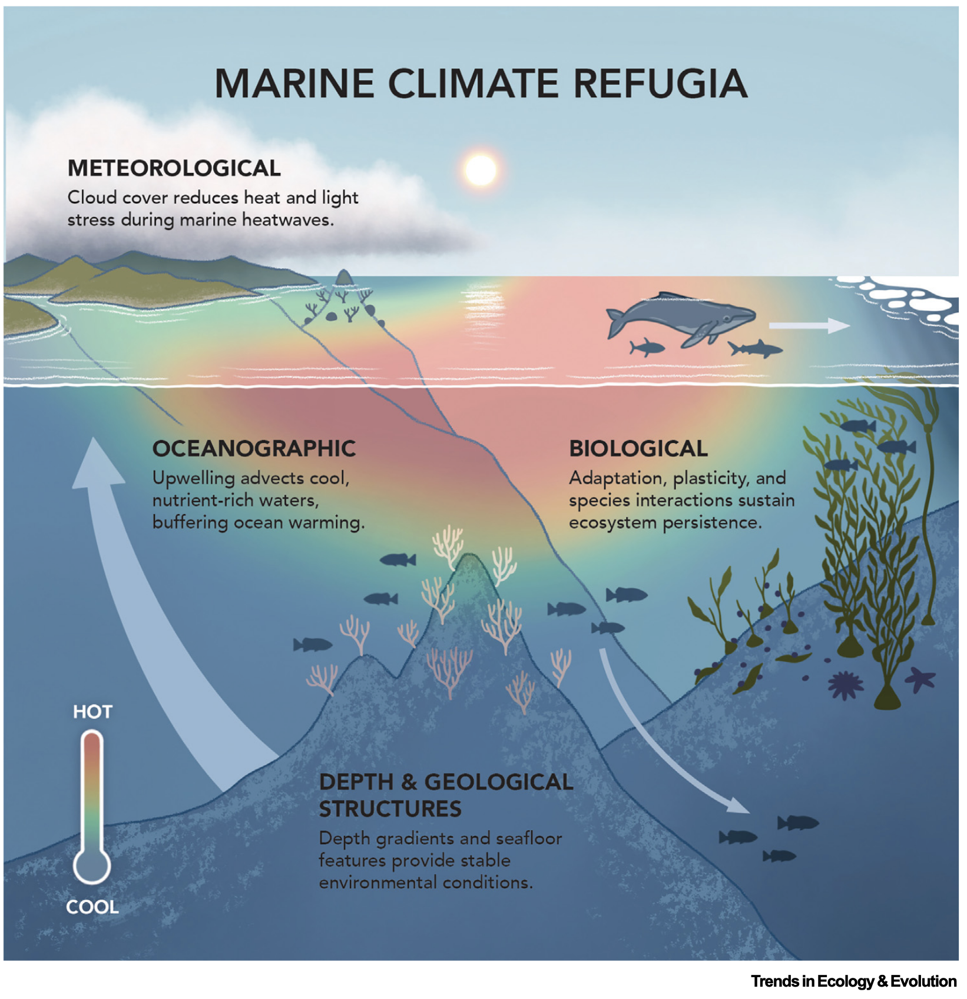
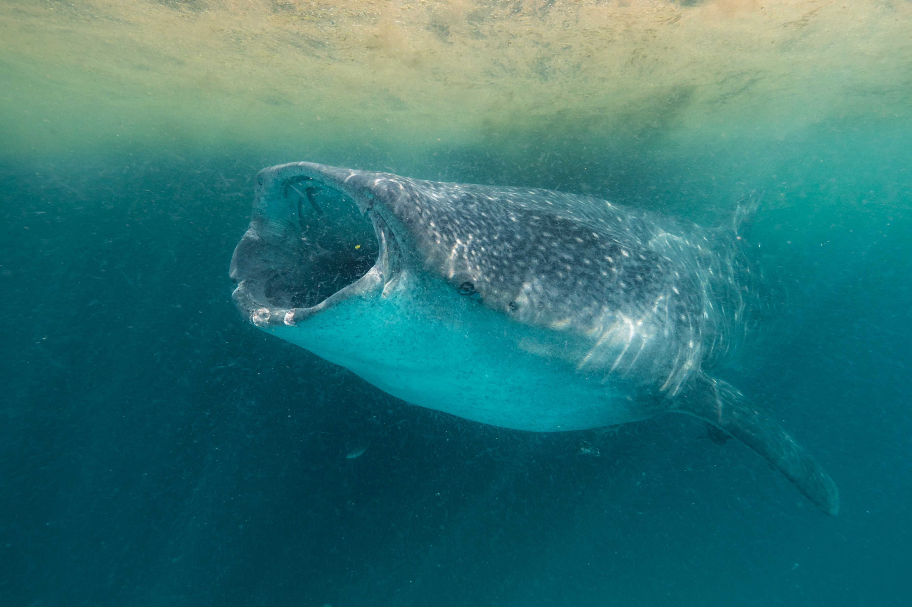
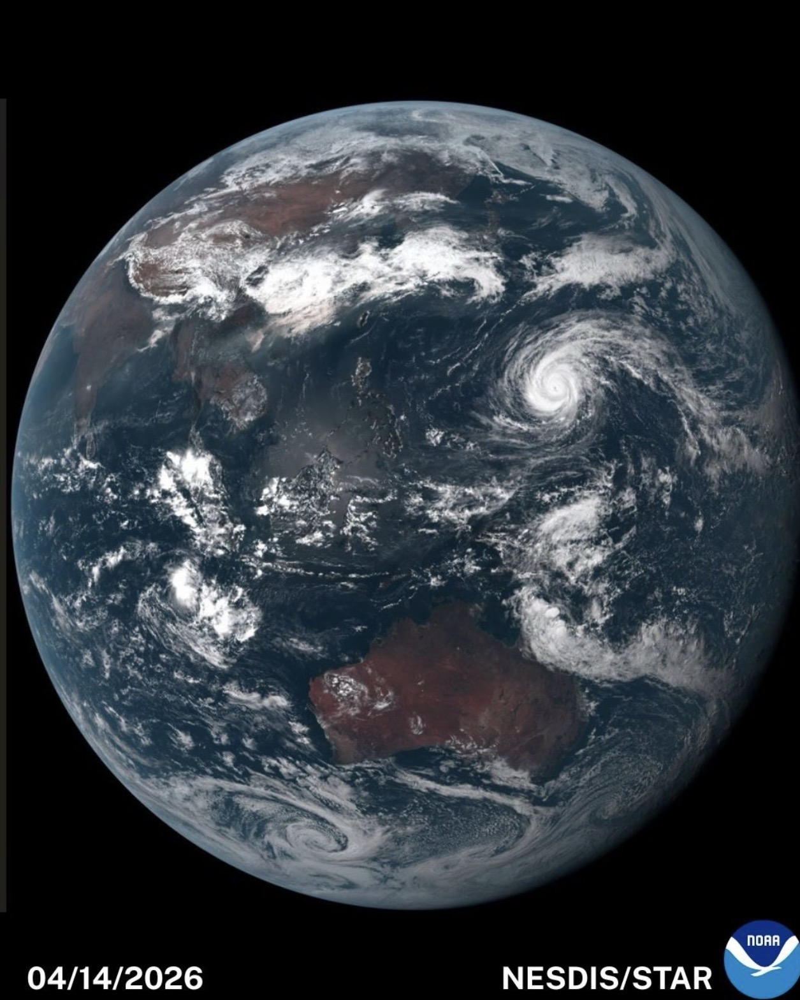

::: {.hero}
::: {.hero-copy}
## Marine ecologist and conservation scientist working across climate change, ocean biodiversity, and reproducible data science.

# Dr Isaac Brito-Morales

I study how climate change reshapes biodiversity in the ocean, and I build reproducible analyses that help conservation decisions travel from data to action.

::: {.hero-actions}
[View publications](publications.qmd){.btn .btn-primary}
[Download CV](content/pdf/isaac_brito_morales_academic_cv.pdf){.btn .btn-outline}
:::
:::

::: {.hero-portrait}
{fig-alt="Portrait of Dr Isaac Brito-Morales"}
:::
:::

::: {.content-band}
::: {.content-grid}
::: {.intro-copy}
## What I Work On

I am a marine ecologist and conservation scientist focused on species redistribution, marine climate exposure, conservation planning, and open, reproducible workflows in R.

My work connects global environmental datasets, ecological theory, and practical conservation needs, with a particular interest in how ocean dynamics shape biodiversity patterns and climate adaptation.
:::

::: {.stat-panel}
::: {.stat}
**Climate change**

Species redistributions, exposure, velocity, and ecological risk.
:::

::: {.stat}
**Marine conservation**

Decision-support science for biodiversity, planning, and adaptation.
:::

::: {.stat}
**Reproducible R**

Transparent workflows, reusable code, and teaching-friendly analysis.
:::
:::
:::
:::

::: {.content-band .subtle}
## Featured Highlights

::: {.feature-grid}
::: {.feature-card}
### New Paper on Marine Climate Refugia

{.feature-image fig-alt="Illustration of marine climate refugia showing meteorological, oceanographic, biological, depth, and geological processes."}

::: {.image-credit}
Figure: Trends in Ecology & Evolution
:::

As the world works toward protecting 30% of the ocean by 2030, a central question remains: which places will still support biodiversity as climate change accelerates? Our new paper in *Trends in Ecology & Evolution* reviews how marine climate refugia can help guide more climate-smart ocean conservation.

[Read the paper](https://www.sciencedirect.com/science/article/pii/S0169534726000807)
:::

::: {.feature-card}
### Current Projects

{.feature-image fig-alt="Whale shark swimming underwater. Photo by Chris Rohner."}

::: {.image-credit}
Photo: Chris Rohner
:::

**Save the Blue 5:** Building 3D species distribution models and climate-data workflows to assess how climate change may reshape migratory marine megafauna habitat across the Southeast Pacific.

[Visit project](https://savethebluefive.net/)
:::

::: {.feature-card}
### Notes and Blog

{.feature-image fig-alt="NOAA satellite view of Earth over the Pacific Ocean on April 14, 2026."}

::: {.image-credit}
Image: NOAA NESDIS/STAR
:::

**Ocean Climate Downscaling:** read a blog I made about building a workflow to transform coarse-resolution future ocean projections into high-resolution 3D marine data layers for species distribution models, climate exposure analyses, and conservation planning.

[Read the post](posts/ocean-climate-downscaling-pipeline/)

::: {.share-menu data-share-url="https://isaakbm.github.io/posts/ocean-climate-downscaling-pipeline/" data-share-title="How I Built an Ocean Climate Downscaling Pipeline" data-share-text="Ocean Climate Downscaling: a workflow for transforming coarse-resolution future ocean projections into high-resolution 3D marine data layers for species distribution models, climate exposure analyses, and conservation planning."}
<button class="share-menu-toggle" type="button" aria-expanded="false">
  <i class="bi bi-share" aria-hidden="true"></i>
  Share
</button>

::: {.share-menu-panel}
[LinkedIn](https://www.linkedin.com/sharing/share-offsite/?url=https%3A%2F%2Fisaakbm.github.io%2Fposts%2Focean-climate-downscaling-pipeline%2F){target="_blank" rel="noopener"}

[Bluesky](https://bsky.app/intent/compose?text=Ocean%20Climate%20Downscaling%3A%20https%3A%2F%2Fisaakbm.github.io%2Fposts%2Focean-climate-downscaling-pipeline%2F){target="_blank" rel="noopener"}

<button class="share-menu-action" type="button" data-share-native>Native share</button>

<button class="share-menu-action" type="button" data-copy-link>Copy link</button>
:::
:::
:::
:::
:::

::: {.content-band}
## Current Snapshot

::: {.timeline}
::: {.timeline-item}
**Senior Associate Scientist, [Conservation International](https://www.conservation.org/home)**

Leading applied research on marine biodiversity, ocean fronts, climate change, and conservation planning.
:::

::: {.timeline-item}
**Research Associate, [UC Santa Barbara Marine Science Institute](https://msi.ucsb.edu/)**

Collaborating on marine science, conservation, and global environmental data analysis.
:::

::: {.timeline-item}
**PhD, [The University of Queensland](https://www.uq.edu.au/)**

Biological sciences, climate change, and conservation.
:::
:::
:::
